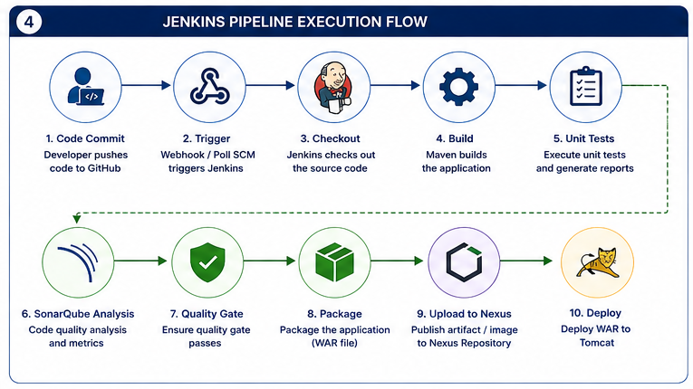
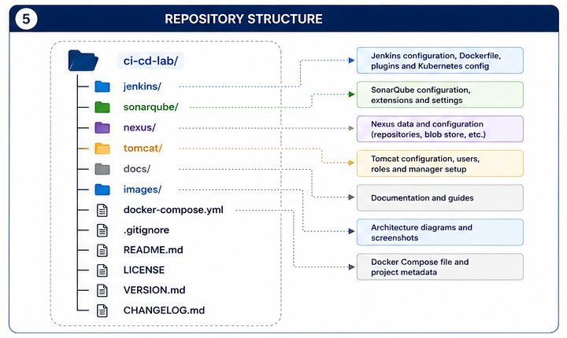

# 🚀 Enterprise DevSecOps Infrastructure Platform

> A production-inspired DevSecOps infrastructure platform built with Docker Compose to provide a reusable CI/CD environment for enterprise application delivery.

---

## Architecture


---

## Project Overview

This repository provides the infrastructure required to support an Enterprise DevSecOps CI/CD pipeline.

The platform includes:

- Jenkins LTS for Continuous Integration
- SonarQube Community Edition for Code Quality
- Nexus Repository OSS for Artifact Management
- Apache Tomcat for Application Deployment
- Docker Compose for Infrastructure Orchestration

This platform is designed to work together with the **automation-deployment-project**, which demonstrates a complete enterprise CI/CD pipeline.

---

# Key Features

- Enterprise DevSecOps Platform
- Docker Compose Infrastructure
- Jenkins Custom Docker Image
- SonarQube Integration
- Nexus Artifact Repository
- Apache Tomcat Deployment Server
- Persistent Docker Volumes
- Shared Docker Network
- Kubernetes CLI
- Helm CLI
- Ready for Enterprise CI/CD

---

# Technology Stack

| Category | Technology |
|----------|------------|
| Container Runtime | Docker |
| Orchestration | Docker Compose |
| CI/CD | Jenkins LTS |
| Code Quality | SonarQube Community |
| Artifact Repository | Nexus OSS |
| Deployment | Apache Tomcat |
| Build Tool | Maven |
| Source Control | Git & GitHub |
| Kubernetes Tools | kubectl, Helm |

---

# Infrastructure Components

| Component | Purpose |
|-----------|---------|
| Jenkins | Continuous Integration |
| SonarQube | Static Code Analysis |
| Nexus Repository | Artifact Storage |
| Apache Tomcat | WAR Deployment |
| Docker Compose | Infrastructure Management |

---

# Docker Compose Topology


---

# Jenkins Pipeline Flow



---

# Repository Structure



```text
ci-cd-lab/
├── docker-compose.yml
├── docs/
├── images/
├── jenkins/
├── nexus/
├── sonarqube/
├── tomcat/
├── README.md
├── LICENSE
├── CHANGELOG.md
└── VERSION.md
```

---

# Quick Start

Clone the repository.

```bash
git clone git@github.com:muralidhargurram39/ci-cd-lab.git

cd ci-cd-lab
```

Start the infrastructure.

```bash
docker compose up -d
```

Verify running containers.

```bash
docker ps
```

---

# Service URLs

| Service | URL |
|----------|-----|
| Jenkins | http://localhost:8080 |
| SonarQube | http://localhost:9000 |
| Nexus Repository | http://localhost:8081 |
| Tomcat | http://localhost:8082 |

---

# Documentation

Complete documentation is available under the **docs/** directory.

- Project Overview
- Prerequisites
- Installation Guide
- Repository Structure
- Jenkins Configuration
- SonarQube Configuration
- Nexus Configuration
- Tomcat Configuration
- Docker Compose
- Troubleshooting
- FAQ

---

# Screenshots

Example screenshots include:

- Jenkins Dashboard
- SonarQube Dashboard
- Nexus Repository
- Apache Tomcat Manager
- Running Docker Containers

---

# Related Projects

This infrastructure supports the following repository:

**automation-deployment-project**

The application repository demonstrates:

- Jenkins Pipeline as Code
- Maven Build
- SonarQube Analysis
- OWASP Dependency Check
- Trivy Security Scan
- Nexus Artifact Upload
- Docker Image Build
- Kubernetes Deployment
- Helm Deployment
- Automated Rollback

---

# Version

Current Version

```
v1.0.0
```

---

# Roadmap

## Version 1.0

- Jenkins
- SonarQube
- Nexus
- Tomcat
- Docker Compose

## Version 2.0

- Prometheus
- Grafana
- Loki
- Promtail
- Harbor Registry

---

# License

MIT License

---

# Author

**Muralidhar G**

Enterprise DevOps | Middleware | CI/CD | Docker | Kubernetes | Jenkins | SonarQube | Nexus | Helm

