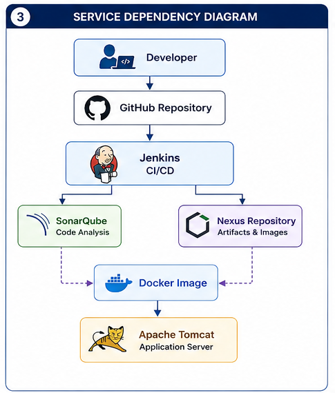

# Nexus Repository

## Overview

Sonatype Nexus Repository Manager is the centralized **Artifact Repository Management Platform** within the Enterprise DevSecOps Infrastructure Platform.

It provides a secure, scalable, and centralized location for storing, managing, versioning, and distributing software artifacts produced during Continuous Integration and Continuous Delivery (CI/CD) pipelines.

Within this platform, Nexus integrates with:

- Jenkins
- Maven
- Docker
- Kubernetes
- Docker Compose

Instead of rebuilding application artifacts repeatedly, Nexus stores immutable versions that can be promoted across development, testing, staging, and production environments.

This approach improves software traceability, release consistency, and deployment reliability.

---

# Nexus Architecture

The following diagram illustrates how Nexus participates within the Enterprise DevSecOps Infrastructure Platform.



Jenkins publishes build outputs to Nexus after successful compilation and validation.

Nexus then serves as the single source of truth for software artifacts, enabling deployments to retrieve versioned packages rather than rebuilding them.

---

# Purpose

The primary objective of Nexus Repository Manager is to centralize software artifacts.

Core responsibilities include:

- Artifact storage
- Version management
- Docker registry
- Maven repository
- Artifact distribution
- Repository proxying
- Dependency caching
- Release management
- Immutable artifact storage
- Secure artifact sharing

By separating artifact storage from build execution, the platform supports reproducible deployments and efficient dependency management.

---

# Key Features

The platform provides the following capabilities.

### Artifact Repository

Stores build outputs generated by Jenkins pipelines.

---

### Docker Registry

Hosts versioned Docker images.

---

### Maven Repository

Stores Java libraries and application packages.

---

### Proxy Repositories

Caches external repositories to reduce internet dependency.

---

### Group Repositories

Aggregates multiple repositories under a single endpoint.

---

### Version Control

Maintains historical versions of artifacts.

---

### Security

Supports user authentication, authorization, and repository-level access control.

---

### Repository Cleanup

Automatically removes obsolete artifacts based on retention policies.

---

# Nexus Deployment

Nexus Repository Manager is deployed using Docker Compose.

Example service definition:

```yaml
nexus:
  image: sonatype/nexus3:latest

  container_name: nexus

  restart: unless-stopped

  ports:
    - "8081:8081"
    - "8082:8082"
    - "8083:8083"

  volumes:
    - nexus_data:/nexus-data

  networks:
    - cicd-network
```

The deployment provides persistent storage for repositories, configuration, and blob stores.

---

# Container Configuration

| Property | Value |
|----------|-------|
| Container Name | nexus |
| Image | sonatype/nexus3 |
| Restart Policy | unless-stopped |
| Data Directory | /nexus-data |
| Network | cicd-network |

---

# Port Configuration

| Port | Purpose |
|------|---------|
| 8081 | Nexus Web UI |
| 8082 | Docker Registry |
| 8083 | Additional Repository Endpoint |

Access the web interface:

```
http://localhost:8081
```

---

# Persistent Storage

All Nexus configuration and repositories are stored within a persistent Docker volume.

| Volume | Purpose |
|---------|---------|
| nexus_data | Repository data, blob stores, configuration, logs |

Persistent storage ensures that repository contents survive container recreation and upgrades.

---

# Blob Store Architecture

Nexus stores artifacts inside **Blob Stores**.

A Blob Store contains:

- Maven artifacts
- Docker layers
- Metadata
- Repository indexes

Logical structure:

```
Blob Store
     │
     ├── Maven Artifacts
     ├── Docker Images
     ├── Metadata
     ├── Checksums
     └── Repository Indexes
```

Using blob stores separates repository metadata from physical storage, improving scalability and manageability.

---

# Repository Types

Nexus supports multiple repository formats.

### Hosted Repositories

Used to store internally produced artifacts.

Examples:

- Maven Hosted
- Docker Hosted

---

### Proxy Repositories

Mirror external repositories.

Examples:

- Maven Central
- Docker Hub

Benefits:

- Faster dependency downloads
- Reduced internet traffic
- Improved build reliability

---

### Group Repositories

Expose multiple repositories through a single endpoint.

Advantages:

- Simplified client configuration
- Centralized dependency management
- Reduced maintenance

---

# Network Configuration

The Nexus container communicates with the following platform components:

- Jenkins
- SonarQube
- Tomcat
- PostgreSQL (indirectly through platform workflows)

using the shared Docker network:

```
cicd-network
```

Internal service communication relies on Docker DNS.

Example internal URL:

```
http://nexus:8081
```

---

# Startup Sequence

Docker Compose starts Nexus independently of other services.

Initialization workflow:

```
Docker Compose
        │
        ▼
Create Container
        │
        ▼
Initialize Blob Store
        │
        ▼
Load Configuration
        │
        ▼
Start Repository Services
        │
        ▼
Start Web Interface
        │
        ▼
Ready
```

On first startup, Nexus initializes its internal database and creates the default repository structure.

---

# Service Dependencies

Within the Enterprise DevSecOps Infrastructure Platform, Nexus integrates with the following components.

| Component | Purpose |
|------------|---------|
| Jenkins | Publishes build artifacts |
| Docker | Pushes and pulls container images |
| Maven | Publishes Java artifacts |
| Kubernetes | Pulls application images during deployment |
| Docker Compose | Service orchestration |

---

# Design Principles

The Nexus deployment follows the same architectural principles as the rest of the platform.

## Infrastructure as Code

Deployment is fully defined in Docker Compose.

---

## Persistent Storage

Repositories and configuration are stored in Docker volumes.

---

## Artifact Immutability

Released artifacts should never be modified after publication.

This ensures reproducible deployments across environments.

---

## Centralized Repository Management

All application artifacts are stored in a single trusted location.

---

## Scalability

The architecture can be extended to support:

- High Availability
- External Blob Stores
- S3-backed storage
- Enterprise licensing
- Reverse Proxy
- SSL termination
- LDAP integration

without major architectural changes.

---

# Summary

Nexus Repository Manager serves as the centralized artifact management platform within the Enterprise DevSecOps Infrastructure Platform.

Integrated with Jenkins, Maven, Docker, Kubernetes, and Docker Compose, Nexus provides secure, persistent, and version-controlled storage for software artifacts and container images.

The next section explains repository types, Maven and Docker repositories, artifact lifecycle, Jenkins integration, repository cleanup, storage optimization, and security management.

---

# Repository Architecture

Nexus Repository Manager organizes software packages into logical repositories based on their purpose and package format.

Each repository is responsible for managing a specific category of artifacts while providing version control, metadata management, and secure access.

Within this platform, Nexus primarily manages:

- Maven artifacts
- Docker container images

The repository architecture is designed to separate internally produced artifacts from externally sourced dependencies.

```
                    Nexus Repository
                           │
      ┌────────────────────┼────────────────────┐
      │                    │                    │
      ▼                    ▼                    ▼
 Hosted Repositories   Proxy Repositories   Group Repositories
      │                    │                    │
      ▼                    ▼                    ▼
 Internal Builds      Maven Central      Unified Access Point
 Docker Images        Docker Hub
```

This layered architecture improves dependency management while reducing external network dependencies.

---

# Maven Hosted Repository

The Maven Hosted Repository stores Java artifacts generated by Jenkins pipelines.

Typical artifacts include:

- JAR files
- WAR files
- EAR files
- POM files

Example Maven deployment:

```bash
mvn clean deploy
```

During deployment Maven uploads:

- Binary artifact
- POM
- Metadata
- Checksums

Each upload creates a new immutable artifact version.

---

# Docker Hosted Registry

Nexus also functions as a private Docker Registry.

Instead of storing container images in Docker Hub, internally built images are published into Nexus.

Example workflow:

```bash
docker build -t nexus.example.com/application:1.0 .
docker push nexus.example.com/application:1.0
```

Benefits include:

- Private image storage
- Faster deployments
- Internal image sharing
- Version control
- Reduced Docker Hub dependency

---

# Proxy Repositories

Proxy repositories cache artifacts from external sources.

Typical proxy repositories include:

- Maven Central
- Docker Hub

Workflow:

```
Developer Request
        │
        ▼
Proxy Repository
        │
 ┌──────┴──────┐
 │             │
Cached      Download
 │             │
 ▼             ▼
Return     External Repository
```

Advantages:

- Faster dependency downloads
- Reduced internet bandwidth
- Improved build reliability
- Offline capability after caching

---

# Group Repositories

Group repositories combine multiple repositories into a single endpoint.

Instead of configuring multiple repository URLs, developers interact with one consolidated repository.

Example:

```
maven-group

├── Maven Hosted
├── Maven Proxy
└── Third-party Repository
```

Benefits:

- Simplified configuration
- Easier maintenance
- Centralized dependency resolution

---

# Artifact Lifecycle

Every artifact follows a defined lifecycle from creation to deployment.

```
Developer Commit
        │
        ▼
Jenkins Build
        │
        ▼
Compile & Test
        │
        ▼
SonarQube Analysis
        │
        ▼
Quality Gate
        │
        ▼
Artifact Packaging
        │
        ▼
Publish to Nexus
        │
        ▼
Deployment
```

This workflow ensures only validated artifacts are stored and deployed.

---

# Docker Image Lifecycle

Container images follow a similar lifecycle.

```
Source Code
      │
      ▼
Docker Buildx
      │
      ▼
Image Scan (Trivy)
      │
      ▼
Push to Nexus
      │
      ▼
Kubernetes Pull
      │
      ▼
Application Running
```

Images remain immutable after publication, enabling reproducible deployments.

---

# Version Management

Every published artifact receives a unique version identifier.

Example:

```
1.0.0
1.0.1
1.1.0
2.0.0
```

Versioning enables:

- Rollbacks
- Release management
- Historical tracking
- Environment consistency

Snapshot and release repositories should remain separate to distinguish development builds from production-ready artifacts.

---

# Jenkins Integration

Jenkins publishes build outputs directly to Nexus.

Typical workflow:

```
GitHub
    │
    ▼
Jenkins
    │
Compile
    │
Test
    │
SonarQube
    │
Quality Gate
    │
Package
    │
Publish
    ▼
Nexus Repository
```

Example Maven deployment stage:

```groovy
stage('Publish Artifact') {
    steps {
        sh 'mvn deploy'
    }
}
```

For Docker images:

```groovy
stage('Push Docker Image') {
    steps {
        sh 'docker push nexus:8082/application:latest'
    }
}
```

---

# Maven Integration

Maven communicates with Nexus through the `distributionManagement` section of the project POM.

Typical configuration:

```xml
<distributionManagement>
    <repository>
        <id>nexus</id>
        <url>http://nexus:8081/repository/maven-releases/</url>
    </repository>
</distributionManagement>
```

Authentication credentials are provided through Maven's `settings.xml` or injected by Jenkins Credentials.

---

# Docker Integration

Docker clients authenticate with the private registry before pushing or pulling images.

Typical commands:

```bash
docker login localhost:8082
```

Push:

```bash
docker push localhost:8082/application:1.0
```

Pull:

```bash
docker pull localhost:8082/application:1.0
```

This allows Kubernetes clusters and other environments to consume internally built images securely.

---

# Kubernetes Integration

Applications deployed into Kubernetes retrieve images directly from the private Nexus registry.

Typical deployment configuration:

```yaml
image:
  repository: nexus:8082/application
  tag: "1.0.0"
```

Using a private registry improves:

- Deployment consistency
- Image availability
- Release control
- Security

---

# Security Model

Nexus provides role-based access control for repositories.

Common permissions include:

- Browse
- Read
- Create
- Update
- Delete
- Admin

Recommended practice is to grant only the minimum permissions required for each user or automation account.

---

# User Management

Typical user categories include:

| Role | Responsibilities |
|------|------------------|
| Administrator | Full repository management |
| Developer | Publish and download development artifacts |
| CI/CD Service Account | Automated uploads from Jenkins |
| Read-Only User | Consume published artifacts |

Separating service accounts from human users improves auditability and security.

---

# Repository Cleanup Policies

Without cleanup, repositories can grow indefinitely.

Recommended cleanup strategies:

- Remove outdated snapshots
- Retain recent releases
- Delete unused Docker image tags
- Remove orphaned metadata

Cleanup policies help optimize storage and improve overall repository performance.

---

# Storage Optimization

To maintain efficient repository storage:

- Enable scheduled cleanup tasks
- Compress blob stores where appropriate
- Monitor disk utilization
- Archive obsolete releases
- Remove unused repositories
- Review storage growth periodically

These practices help ensure long-term scalability as the number of artifacts increases.

---

# Summary

Nexus Repository Manager provides centralized artifact management for both Maven packages and Docker images.

Through hosted, proxy, and group repositories, it enables secure storage, version management, dependency caching, and seamless integration with Jenkins, Maven, Docker, and Kubernetes.

The next section covers operational verification, health checks, backup and restore procedures, troubleshooting, security best practices, operational guidance, and the relationship between Nexus Repository Manager and the companion automation deployment project.

---

# Verification

After deploying the Enterprise DevSecOps Infrastructure Platform, verify that Nexus Repository Manager is operational before integrating it into Jenkins pipelines.

---

## Verify Container Status

Ensure the Nexus container is running.

```bash
docker ps
```

Expected container:

```
nexus
```

---

## Verify Docker Compose Services

```bash
docker compose ps
```

Expected status:

```
nexus    Up
```

---

## Verify Nexus Logs

Review the startup logs.

```bash
docker logs nexus
```

Expected messages include:

```
Started Sonatype Nexus Repository
Started Nexus Repository Manager
```

---

## Verify Web Interface

Open:

```
http://localhost:8081
```

Expected result:

- Nexus login page
- Repository Manager dashboard

---

## Retrieve Initial Administrator Password

For first-time login:

```bash
docker exec nexus \
cat /nexus-data/admin.password
```

After logging in, change the default administrator password immediately.

---

## Verify Repository Availability

Browse:

```
Administration
        │
        ▼
Repositories
```

Verify the expected repositories exist.

Typical repositories include:

- maven-releases
- maven-snapshots
- maven-public
- docker-hosted
- docker-proxy
- docker-group

---

## Verify Maven Connectivity

Execute:

```bash
mvn deploy
```

Expected result:

Artifacts are uploaded successfully to the configured hosted repository.

---

## Verify Docker Registry

Login:

```bash
docker login localhost:8082
```

Push image:

```bash
docker push localhost:8082/application:1.0.0
```

Pull image:

```bash
docker pull localhost:8082/application:1.0.0
```

Verify the image appears within the Docker Hosted repository.

---

## Verify Jenkins Connectivity

From the Jenkins container:

```bash
docker exec jenkins curl http://nexus:8081
```

Expected result:

HTTP response confirming successful connectivity.

---

# Health Checks

Routine operational verification should include:

- Nexus container running
- Web interface accessible
- Blob store available
- Docker registry operational
- Maven repository accessible
- Jenkins connectivity verified
- Storage utilization monitored
- Scheduled cleanup tasks operational

---

# Operational Maintenance

Routine maintenance helps maintain repository performance and reliability.

Recommended tasks:

- Upgrade Nexus Repository Manager
- Review repository permissions
- Monitor blob store utilization
- Review cleanup policies
- Archive obsolete artifacts
- Monitor JVM memory usage
- Monitor disk utilization
- Review audit logs
- Remove inactive repositories
- Verify backup completion

---

# Backup Strategy

Persistent data is stored within the Docker volume:

| Volume | Purpose |
|---------|---------|
| nexus_data | Repository data, configuration, blob stores, security settings |

The following information should be included in routine backups:

- Hosted repositories
- Proxy cache
- Blob stores
- Repository configuration
- Security configuration
- User accounts
- Scheduled tasks

Recommended backup schedule:

- Development: Weekly
- Production: Daily

---

# Restore Strategy

To restore Nexus:

Stop the platform:

```bash
docker compose down
```

Restore the Docker volume.

Restart:

```bash
docker compose up -d
```

Verify:

- Repository availability
- Blob stores
- User accounts
- Repository permissions
- Docker registry
- Maven repositories

---

# Performance Optimization

Large repositories require routine optimization.

Recommended practices:

## Storage

- Monitor blob store growth
- Remove obsolete snapshots
- Archive old releases

---

## JVM

Allocate sufficient memory using JVM options.

Monitor:

- Heap utilization
- Garbage collection

---

## Cleanup Policies

Automate:

- Snapshot removal
- Docker image cleanup
- Temporary artifact removal

---

## Docker Resources

Ensure sufficient:

- CPU
- Memory
- Disk

to support repository indexing and artifact uploads.

---

# Troubleshooting

## Nexus Container Does Not Start

Review logs:

```bash
docker logs nexus
```

Common causes:

- Insufficient memory
- Port conflicts
- Corrupted volume
- File permission issues

---

## Web Interface Not Accessible

Verify:

```bash
docker ps
```

Confirm:

- Port 8081 exposed
- Container running
- Firewall configuration

---

## Docker Push Failure

Verify:

```bash
docker login
```

Check:

- Registry URL
- Authentication
- Repository configuration
- Docker daemon

---

## Maven Deploy Failure

Verify:

- distributionManagement configuration
- Repository URL
- Credentials
- Network connectivity

---

## Blob Store Full

Review:

```
Administration
        │
Blob Stores
```

Recommended actions:

- Expand storage
- Remove obsolete artifacts
- Execute cleanup policies

---

## Jenkins Cannot Publish Artifacts

Verify:

- Jenkins credentials
- Nexus credentials
- Repository permissions
- Docker network
- Repository URL

---

## Repository Index Issues

Rebuild repository indexes if search results become inconsistent.

---

## Authentication Problems

Verify:

- User account
- Password
- Role assignment
- Repository permissions

---

# Security Best Practices

To improve repository security:

- Change the default administrator password immediately.
- Use dedicated CI/CD service accounts.
- Enable least-privilege access.
- Separate administrator and developer accounts.
- Remove inactive users.
- Regularly review repository permissions.
- Rotate credentials periodically.
- Back up repository configuration.
- Restrict Docker registry access.
- Keep Nexus Repository Manager updated.

---

# Operational Best Practices

Recommended operational guidelines:

- Publish only validated artifacts.
- Separate snapshot and release repositories.
- Never overwrite released versions.
- Monitor storage utilization.
- Schedule cleanup tasks.
- Version-control repository configuration.
- Back up blob stores.
- Document repository policies.
- Periodically review user access.
- Monitor upload failures.

---

# Integration with Jenkins

Within the Enterprise DevSecOps Infrastructure Platform, Jenkins publishes validated artifacts directly into Nexus.

Typical pipeline sequence:

```
GitHub
    │
    ▼
Jenkins Checkout
    │
    ▼
Maven Build
    │
    ▼
Unit Tests
    │
    ▼
SonarQube Analysis
    │
    ▼
Quality Gate
    │
    ▼
Package
    │
    ▼
Publish to Nexus
    │
    ▼
Docker Registry
    │
    ▼
Kubernetes Deployment
```

This workflow ensures that only validated and versioned artifacts are deployed.

---

# Artifact Promotion Strategy

A recommended enterprise promotion workflow is:

```
Development
        │
        ▼
Snapshot Repository
        │
        ▼
Testing
        │
        ▼
Release Repository
        │
        ▼
Production
```

This prevents unstable development artifacts from being deployed into production environments.

---

# Related Project

This infrastructure repository provides the Nexus Repository Manager platform used by the companion repository:

**automation-deployment-project**

The companion repository demonstrates:

- Maven package publishing
- Docker image publishing
- Jenkins pipeline automation
- SonarQube Quality Gate validation
- Trivy security scanning
- Kubernetes deployments
- Helm-based releases

Together, both repositories demonstrate a complete Enterprise DevSecOps implementation from source code commit through artifact publication and deployment.

---

# Summary

Nexus Repository Manager serves as the centralized artifact repository within the Enterprise DevSecOps Infrastructure Platform.

Integrated with Jenkins, Maven, Docker, Kubernetes, and Docker Compose, it provides secure, version-controlled storage for application artifacts and container images.

Key capabilities include:

- Hosted Maven repositories
- Private Docker registry
- Proxy repositories
- Group repositories
- Blob store architecture
- Artifact version management
- Immutable artifact storage
- Jenkins integration
- Maven integration
- Docker integration
- Kubernetes image distribution
- Repository cleanup policies
- Persistent Docker storage
- Infrastructure as Code

By centralizing artifact management, Nexus enables reproducible deployments, consistent release management, and secure software distribution while forming a critical component of the Enterprise DevSecOps Infrastructure Platform.

---

## Next Document

Continue with:

**08_Tomcat.md**

The next guide will cover:

- Apache Tomcat Architecture
- Docker Compose Deployment
- Container Configuration
- WAR Deployment
- Application Lifecycle
- Jenkins Integration
- Logging
- Persistent Storage
- Security Best Practices
- Operational Maintenance
- Troubleshooting
