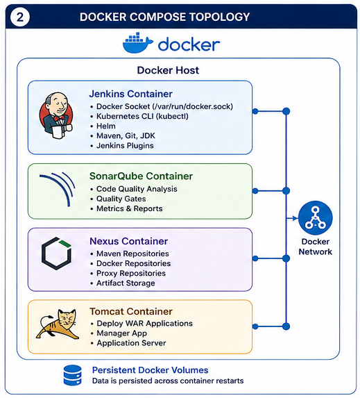

# Docker Compose

## Overview

Docker Compose is the Infrastructure as Code (IaC) orchestration layer for the Enterprise DevSecOps Infrastructure Platform.

Rather than deploying individual containers manually, Docker Compose provisions, configures, networks, and manages the complete platform using a single declarative configuration file.

Within this project, Docker Compose orchestrates the following core services:

- Jenkins
- SonarQube
- PostgreSQL
- Nexus Repository Manager
- Apache Tomcat

Together, these services provide a complete Continuous Integration, Continuous Delivery (CI/CD), artifact management, application hosting, and software quality platform.

Using Docker Compose provides:

- Infrastructure as Code
- Repeatable deployments
- Automated networking
- Persistent storage management
- Service orchestration
- Simplified platform lifecycle management

---

# Platform Architecture

The Enterprise DevSecOps platform is composed of multiple independent services that work together to automate the software delivery lifecycle.



High-level architecture:

```
                    Enterprise DevSecOps Platform

                           Developer
                               │
                               ▼
                           GitHub Repository
                               │
                               ▼
                           Jenkins CI/CD
                               │
              ┌────────────────┴────────────────┐
              │                                 │
              ▼                                 ▼
       SonarQube Analysis                 Nexus Repository
              │                                 │
              └────────────────┬────────────────┘
                               ▼
                         Apache Tomcat
                               │
                               ▼
                      Running Application
```

Each service has a clearly defined responsibility while remaining loosely coupled through Docker networking.

---

# Why Docker Compose?

Docker Compose was selected because it provides a simple, declarative approach to orchestrating a multi-container platform.

Benefits include:

- Single-command deployment
- Centralized configuration
- Automatic service networking
- Persistent volume management
- Environment consistency
- Rapid platform provisioning
- Easy local development
- Simplified maintenance

Instead of manually configuring each service, Docker Compose provisions the complete environment using a version-controlled configuration.

---

# Platform Components

The platform consists of the following services.

| Service | Purpose |
|----------|---------|
| Jenkins | Continuous Integration and deployment automation |
| SonarQube | Static code analysis and quality gates |
| PostgreSQL | SonarQube metadata database |
| Nexus Repository Manager | Artifact and Docker image repository |
| Apache Tomcat | Java application runtime |

Each service is deployed as an isolated Docker container while communicating through shared Docker networks.

---

# Docker Compose File Structure

The platform is defined by a single Compose file.

Typical structure:

```yaml
services:
  jenkins:
    ...

  sonarqube:
    ...

  sonar-postgres:
    ...

  nexus:
    ...

  tomcat:
    ...

volumes:
  ...

networks:
  ...
```

This declarative approach enables the entire platform to be recreated consistently across environments.

---

# Service Inventory

## Jenkins

Responsibilities:

- Build automation
- Pipeline execution
- Deployment orchestration
- Tool integration

Ports:

- 8080
- 50000

Persistent Volume:

```
jenkins_home
```

---

## SonarQube

Responsibilities:

- Static analysis
- Quality Gates
- Security Hotspots
- Technical Debt tracking

Port:

```
9000
```

Persistent Volumes:

- sonarqube_data
- sonarqube_logs
- sonarqube_extensions

---

## PostgreSQL

Responsibilities:

- SonarQube metadata storage
- Analysis history
- User configuration

Persistent Volume:

```
sonar_postgres_data
```

---

## Nexus Repository Manager

Responsibilities:

- Maven repository
- Docker registry
- Artifact versioning
- Dependency caching

Ports:

- 8081
- 8082
- 8083

Persistent Volume:

```
nexus_data
```

---

## Apache Tomcat

Responsibilities:

- Java application hosting
- WAR deployment
- HTTP request processing

Port:

```
9090:8080
```

Persistent Volume:

```
tomcat_webapps
```

---

# Service Dependencies

The platform follows a logical dependency model.

```
PostgreSQL
      │
      ▼
SonarQube

Jenkins
      │
      ▼
SonarQube

Jenkins
      │
      ▼
Nexus

Jenkins
      │
      ▼
Tomcat
```

Responsibilities remain independent while the CI/CD pipeline coordinates interactions between services.

---

# Platform Startup Sequence

Docker Compose initializes services in a controlled order.

```
docker compose up -d
          │
          ▼
Create Networks
          │
          ▼
Create Volumes
          │
          ▼
Start PostgreSQL
          │
          ▼
Start SonarQube
          │
          ▼
Start Jenkins
          │
          ▼
Start Nexus
          │
          ▼
Start Tomcat
          │
          ▼
Platform Ready
```

Starting infrastructure components before dependent services reduces initialization failures.

---

# Docker Networks

The platform uses an internal bridge network for service-to-service communication.

Primary network:

```yaml
cicd-network
```

An additional external network connects Docker services with the local Kubernetes cluster.

```yaml
kind
```

Network topology:

```
             cicd-network
────────────────────────────────────

Jenkins

SonarQube

PostgreSQL

Nexus

Tomcat

────────────────────────────────────

          External Network

               kind
```

Docker automatically provides DNS resolution within the network.

Examples:

```
http://jenkins:8080
```

```
http://sonarqube:9000
```

```
http://nexus:8081
```

```
http://tomcat:8080
```

---

# Persistent Volumes

Persistent storage prevents data loss when containers are recreated.

| Volume | Purpose |
|---------|---------|
| jenkins_home | Jenkins configuration and jobs |
| sonarqube_data | Analysis indexes |
| sonarqube_logs | SonarQube logs |
| sonarqube_extensions | Plugins |
| sonar_postgres_data | Database |
| nexus_data | Artifact repositories |
| tomcat_webapps | WAR deployments |

Separating application data from containers enables upgrades without losing state.

---

# Port Allocation

Each service exposes only the ports required for platform operation.

| Service | Host Port | Container Port |
|----------|----------:|---------------:|
| Jenkins | 8080 | 8080 |
| Jenkins Agent | 50000 | 50000 |
| SonarQube | 9000 | 9000 |
| Nexus UI | 8081 | 8081 |
| Nexus Docker Registry | 8082 | 8082 |
| Nexus Additional Repository | 8083 | 8083 |
| Tomcat | 9090 | 8080 |

This allocation avoids port conflicts while providing consistent access to platform services.

---

# Design Principles

The Docker Compose deployment follows several architectural principles.

## Infrastructure as Code

The entire platform is defined through version-controlled configuration.

---

## Container Isolation

Each service runs in its own dedicated container with clearly defined responsibilities.

---

## Persistent State

Application data is stored in Docker volumes rather than inside containers.

---

## Standardized Networking

Services communicate using Docker DNS over dedicated bridge networks.

---

## Reproducible Deployments

Any environment with Docker and Docker Compose can recreate the same platform using identical configuration.

---

## Loose Coupling

Each service can be upgraded, restarted, or replaced independently while maintaining platform stability.

---

# Summary

Docker Compose serves as the orchestration layer for the Enterprise DevSecOps Infrastructure Platform.

By defining infrastructure as code, Docker Compose provisions Jenkins, SonarQube, PostgreSQL, Nexus Repository Manager, and Apache Tomcat as a unified platform with shared networking, persistent storage, and automated service management.

The next section explains service lifecycle management, networking internals, runtime orchestration, configuration management, and inter-service communication in greater detail.

# Docker Compose

## Overview

Docker Compose is the Infrastructure as Code (IaC) orchestration layer for the Enterprise DevSecOps Infrastructure Platform.

Rather than deploying individual containers manually, Docker Compose provisions, configures, networks, and manages the complete platform using a single declarative configuration file.

Within this project, Docker Compose orchestrates the following core services:

- Jenkins
- SonarQube
- PostgreSQL
- Nexus Repository Manager
- Apache Tomcat

Together, these services provide a complete Continuous Integration, Continuous Delivery (CI/CD), artifact management, application hosting, and software quality platform.

Using Docker Compose provides:

- Infrastructure as Code
- Repeatable deployments
- Automated networking
- Persistent storage management
- Service orchestration
- Simplified platform lifecycle management

---

# Platform Architecture

The Enterprise DevSecOps platform is composed of multiple independent services that work together to automate the software delivery lifecycle.


High-level architecture:

```
                    Enterprise DevSecOps Platform

                           Developer
                               │
                               ▼
                           GitHub Repository
                               │
                               ▼
                           Jenkins CI/CD
                               │
              ┌────────────────┴────────────────┐
              │                                 │
              ▼                                 ▼
       SonarQube Analysis                 Nexus Repository
              │                                 │
              └────────────────┬────────────────┘
                               ▼
                         Apache Tomcat
                               │
                               ▼
                      Running Application
```

Each service has a clearly defined responsibility while remaining loosely coupled through Docker networking.

---

# Why Docker Compose?

Docker Compose was selected because it provides a simple, declarative approach to orchestrating a multi-container platform.

Benefits include:

- Single-command deployment
- Centralized configuration
- Automatic service networking
- Persistent volume management
- Environment consistency
- Rapid platform provisioning
- Easy local development
- Simplified maintenance

Instead of manually configuring each service, Docker Compose provisions the complete environment using a version-controlled configuration.

---

# Platform Components

The platform consists of the following services.

| Service | Purpose |
|----------|---------|
| Jenkins | Continuous Integration and deployment automation |
| SonarQube | Static code analysis and quality gates |
| PostgreSQL | SonarQube metadata database |
| Nexus Repository Manager | Artifact and Docker image repository |
| Apache Tomcat | Java application runtime |

Each service is deployed as an isolated Docker container while communicating through shared Docker networks.

---

# Docker Compose File Structure

The platform is defined by a single Compose file.

Typical structure:

```yaml
services:
  jenkins:
    ...

  sonarqube:
    ...

  sonar-postgres:
    ...

  nexus:
    ...

  tomcat:
    ...

volumes:
  ...

networks:
  ...
```

This declarative approach enables the entire platform to be recreated consistently across environments.

---

# Service Inventory

## Jenkins

Responsibilities:

- Build automation
- Pipeline execution
- Deployment orchestration
- Tool integration

Ports:

- 8080
- 50000

Persistent Volume:

```
jenkins_home
```

---

## SonarQube

Responsibilities:

- Static analysis
- Quality Gates
- Security Hotspots
- Technical Debt tracking

Port:

```
9000
```

Persistent Volumes:

- sonarqube_data
- sonarqube_logs
- sonarqube_extensions

---

## PostgreSQL

Responsibilities:

- SonarQube metadata storage
- Analysis history
- User configuration

Persistent Volume:

```
sonar_postgres_data
```

---

## Nexus Repository Manager

Responsibilities:

- Maven repository
- Docker registry
- Artifact versioning
- Dependency caching

Ports:

- 8081
- 8082
- 8083

Persistent Volume:

```
nexus_data
```

---

## Apache Tomcat

Responsibilities:

- Java application hosting
- WAR deployment
- HTTP request processing

Port:

```
9090:8080
```

Persistent Volume:

```
tomcat_webapps
```

---

# Service Dependencies

The platform follows a logical dependency model.

```
PostgreSQL
      │
      ▼
SonarQube

Jenkins
      │
      ▼
SonarQube

Jenkins
      │
      ▼
Nexus

Jenkins
      │
      ▼
Tomcat
```

Responsibilities remain independent while the CI/CD pipeline coordinates interactions between services.

---

# Platform Startup Sequence

Docker Compose initializes services in a controlled order.

```
docker compose up -d
          │
          ▼
Create Networks
          │
          ▼
Create Volumes
          │
          ▼
Start PostgreSQL
          │
          ▼
Start SonarQube
          │
          ▼
Start Jenkins
          │
          ▼
Start Nexus
          │
          ▼
Start Tomcat
          │
          ▼
Platform Ready
```

Starting infrastructure components before dependent services reduces initialization failures.

---

# Docker Networks

The platform uses an internal bridge network for service-to-service communication.

Primary network:

```yaml
cicd-network
```

An additional external network connects Docker services with the local Kubernetes cluster.

```yaml
kind
```

Network topology:

```
             cicd-network
────────────────────────────────────

Jenkins

SonarQube

PostgreSQL

Nexus

Tomcat

────────────────────────────────────

          External Network

               kind
```

Docker automatically provides DNS resolution within the network.

Examples:

```
http://jenkins:8080
```

```
http://sonarqube:9000
```

```
http://nexus:8081
```

```
http://tomcat:8080
```

---

# Persistent Volumes

Persistent storage prevents data loss when containers are recreated.

| Volume | Purpose |
|---------|---------|
| jenkins_home | Jenkins configuration and jobs |
| sonarqube_data | Analysis indexes |
| sonarqube_logs | SonarQube logs |
| sonarqube_extensions | Plugins |
| sonar_postgres_data | Database |
| nexus_data | Artifact repositories |
| tomcat_webapps | WAR deployments |

Separating application data from containers enables upgrades without losing state.

---

# Port Allocation

Each service exposes only the ports required for platform operation.

| Service | Host Port | Container Port |
|----------|----------:|---------------:|
| Jenkins | 8080 | 8080 |
| Jenkins Agent | 50000 | 50000 |
| SonarQube | 9000 | 9000 |
| Nexus UI | 8081 | 8081 |
| Nexus Docker Registry | 8082 | 8082 |
| Nexus Additional Repository | 8083 | 8083 |
| Tomcat | 9090 | 8080 |

This allocation avoids port conflicts while providing consistent access to platform services.

---

# Design Principles

The Docker Compose deployment follows several architectural principles.

## Infrastructure as Code

The entire platform is defined through version-controlled configuration.

---

## Container Isolation

Each service runs in its own dedicated container with clearly defined responsibilities.

---

## Persistent State

Application data is stored in Docker volumes rather than inside containers.

---

## Standardized Networking

Services communicate using Docker DNS over dedicated bridge networks.

---

## Reproducible Deployments

Any environment with Docker and Docker Compose can recreate the same platform using identical configuration.

---

## Loose Coupling

Each service can be upgraded, restarted, or replaced independently while maintaining platform stability.

---

# Summary

Docker Compose serves as the orchestration layer for the Enterprise DevSecOps Infrastructure Platform.

By defining infrastructure as code, Docker Compose provisions Jenkins, SonarQube, PostgreSQL, Nexus Repository Manager, and Apache Tomcat as a unified platform with shared networking, persistent storage, and automated service management.

The next section explains service lifecycle management, networking internals, runtime orchestration, configuration management, and inter-service communication in greater detail.

---

# Platform Verification

After deploying the Enterprise DevSecOps Infrastructure Platform, verify that all services are operational before running CI/CD pipelines.

---

## Verify Docker Compose Configuration

Validate the Compose file syntax and merged configuration.

```bash
docker compose config
```

Expected result:

- Configuration is valid
- No YAML parsing errors
- All services, networks, and volumes are resolved correctly

---

## Verify Platform Status

List all running services.

```bash
docker compose ps
```

Expected output:

| Service | Status |
|----------|--------|
| jenkins | Up |
| sonarqube | Up |
| sonar-postgres | Up (healthy) |
| nexus | Up |
| tomcat | Up |

---

## Verify Container Health

Inspect container status.

```bash
docker ps
```

Confirm:

- All expected containers are running
- No restart loops
- Correct port mappings are present

---

## Verify Platform Logs

View logs for all services.

```bash
docker compose logs
```

Inspect logs for a specific service.

```bash
docker compose logs jenkins
docker compose logs sonarqube
docker compose logs nexus
docker compose logs tomcat
```

Ensure there are no startup failures or repeated error messages.

---

## Verify Docker Networks

Display available Docker networks.

```bash
docker network ls
```

Inspect the platform network.

```bash
docker network inspect cicd-network
```

Verify that all platform containers are attached to the shared network.

---

## Verify Persistent Volumes

List persistent volumes.

```bash
docker volume ls
```

Expected volumes include:

- jenkins_home
- sonarqube_data
- sonarqube_logs
- sonarqube_extensions
- sonar_postgres_data
- nexus_data
- tomcat_webapps

---

## Verify Service Endpoints

Confirm each service is reachable.

| Service | URL |
|----------|-----|
| Jenkins | http://localhost:8080 |
| SonarQube | http://localhost:9000 |
| Nexus | http://localhost:8081 |
| Tomcat | http://localhost:9090 |

---

# Health Checks

Routine operational health checks should verify:

- Docker daemon running
- Docker Compose configuration valid
- Containers running
- Shared network operational
- Persistent volumes mounted
- Jenkins accessible
- SonarQube operational
- PostgreSQL healthy
- Nexus repository available
- Tomcat serving applications

Recommended cadence:

| Environment | Frequency |
|--------------|-----------|
| Development | Daily |
| Production | Continuous monitoring |

---

# Operational Maintenance

Regular maintenance improves stability and reliability.

Recommended activities:

- Upgrade Docker Engine
- Upgrade Docker Compose
- Update container images
- Remove unused images
- Remove unused networks
- Remove orphaned containers
- Monitor disk utilization
- Review container logs
- Verify backups
- Apply security updates

---

# Platform Lifecycle Operations

## Start Platform

```bash
docker compose up -d
```

---

## Stop Platform

```bash
docker compose down
```

---

## Restart Platform

```bash
docker compose restart
```

---

## Restart a Single Service

Example:

```bash
docker compose restart jenkins
```

---

## Recreate Containers

```bash
docker compose up -d --force-recreate
```

---

## Remove Unused Resources

```bash
docker system prune
```

Use with caution in shared environments.

---

# Backup Strategy

The platform stores persistent data in Docker volumes.

| Volume | Purpose |
|---------|----------|
| jenkins_home | Jenkins jobs and configuration |
| sonarqube_data | Analysis indexes |
| sonarqube_logs | SonarQube logs |
| sonarqube_extensions | Plugins |
| sonar_postgres_data | PostgreSQL data |
| nexus_data | Artifact repositories |
| tomcat_webapps | Deployed applications |

Recommended backup schedule:

| Environment | Frequency |
|-------------|-----------|
| Development | Weekly |
| Production | Daily |

Backups should include:

- Docker volumes
- Compose file
- Environment files
- Custom configuration
- SSL certificates
- Pipeline definitions

---

# Restore Strategy

Recovery workflow:

1. Stop the platform.

```bash
docker compose down
```

2. Restore Docker volumes.

3. Restore configuration files.

4. Start the platform.

```bash
docker compose up -d
```

5. Verify:

- Services running
- Networks attached
- Volumes mounted
- Applications accessible

---

# Troubleshooting

## Compose Configuration Errors

Validate configuration.

```bash
docker compose config
```

Correct YAML formatting issues before deployment.

---

## Container Startup Failure

Inspect logs.

```bash
docker compose logs <service>
```

Review:

- Image availability
- Environment variables
- Volume mounts
- Port bindings

---

## Port Conflict

Determine which process is using the required port.

Linux:

```bash
ss -tulpn
```

or

```bash
netstat -tulpn
```

Resolve conflicts before restarting the platform.

---

## Volume Mount Issues

Inspect volumes.

```bash
docker volume ls
```

Verify mount points inside containers.

```bash
docker inspect <container>
```

---

## Network Connectivity Problems

Inspect the shared network.

```bash
docker network inspect cicd-network
```

Verify all expected containers are connected.

---

## Restart Loop

Inspect restart count.

```bash
docker ps
```

Review service logs to identify startup failures.

---

## Resource Exhaustion

Monitor host resources.

```bash
docker stats
```

Investigate:

- CPU utilization
- Memory usage
- Disk utilization
- Network traffic

---

# Performance Optimization

For larger workloads:

## CPU

Allocate sufficient CPU cores to Docker.

---

## Memory

Increase Docker memory allocation for:

- Jenkins
- SonarQube
- Nexus

---

## Storage

Use fast SSD storage for:

- Docker volumes
- PostgreSQL
- Nexus blob store

---

## Logging

Implement log rotation to prevent excessive disk consumption.

---

## Image Management

Regularly remove unused:

- Images
- Containers
- Networks
- Volumes (after confirming they are no longer needed)

---

# Security Best Practices

The platform should follow enterprise security principles.

Recommended practices:

- Keep Docker Engine updated.
- Keep container images updated.
- Use trusted container images.
- Restrict Docker socket access.
- Avoid running containers as root where possible.
- Use dedicated service accounts.
- Limit exposed ports.
- Store secrets outside source control.
- Review container permissions regularly.
- Scan images before deployment.

---

# Operational Best Practices

Recommended operational guidelines:

- Version-control all infrastructure.
- Automate deployments.
- Monitor service health.
- Validate backups regularly.
- Rotate credentials.
- Archive logs according to retention policies.
- Test recovery procedures.
- Review container resource usage.
- Keep documentation current.
- Review Compose configuration after platform changes.

---

# Summary

Docker Compose provides a unified operational framework for the Enterprise DevSecOps Infrastructure Platform.

Through centralized lifecycle management, networking, persistent storage, verification procedures, backup strategies, troubleshooting guidance, and security controls, the platform can be deployed and maintained consistently across development and testing environments.

The final section presents the overall DevSecOps workflow, Infrastructure as Code philosophy, high availability considerations, Kubernetes migration roadmap, and the relationship between this infrastructure repository and the companion automation deployment project.

---

# Enterprise DevSecOps Workflow

Docker Compose orchestrates every component of the Enterprise DevSecOps Infrastructure Platform while the CI/CD pipeline automates the complete software delivery lifecycle.

Overall platform workflow:

```
                   Enterprise DevSecOps Workflow

                       Developer Commit
                              │
                              ▼
                        GitHub Repository
                              │
                              ▼
                      Jenkins Pipeline
                              │
        ┌─────────────────────┼─────────────────────┐
        │                     │                     │
        ▼                     ▼                     ▼
   Maven Build         Unit Testing        SonarQube Analysis
                                                │
                                                ▼
                                         Quality Gate
                                                │
                                                ▼
                                        Package WAR/JAR
                                                │
                                                ▼
                                       Publish to Nexus
                                                │
                                                ▼
                                      Versioned Artifacts
                                                │
                                                ▼
                                   Deploy to Apache Tomcat
                                                │
                                                ▼
                                       Health Verification
                                                │
                                                ▼
                                     Running Application
```

Each platform component has a dedicated responsibility while Docker Compose provides the infrastructure required for reliable execution.

---

# Component Responsibilities

The platform follows a separation-of-concerns architecture.

| Component | Primary Responsibility |
|-----------|------------------------|
| GitHub | Source code management |
| Jenkins | Continuous Integration & Deployment |
| SonarQube | Static code analysis and Quality Gates |
| PostgreSQL | SonarQube metadata persistence |
| Nexus Repository Manager | Artifact and container registry |
| Apache Tomcat | Java application runtime |
| Docker Compose | Infrastructure orchestration |

This modular architecture simplifies maintenance, upgrades, and future expansion.

---

# Infrastructure as Code

The complete platform is managed as code.

Infrastructure components are defined declaratively using Docker Compose rather than manual installation procedures.

Benefits include:

- Version-controlled infrastructure
- Reproducible environments
- Faster onboarding
- Automated provisioning
- Simplified disaster recovery
- Consistent configuration across environments

Infrastructure changes are reviewed, tracked, and maintained using the same practices applied to application source code.

---

# Immutable Infrastructure Principles

The platform follows immutable infrastructure concepts wherever practical.

Guiding principles include:

- Containers are recreated rather than modified.
- WAR files are versioned and immutable.
- Docker images are rebuilt instead of patched.
- Infrastructure changes are applied through Compose updates.
- Deployments use versioned artifacts stored in Nexus.

These practices reduce configuration drift and improve deployment consistency.

---

# Enterprise Design Principles

The platform architecture is based on the following principles.

## Modularity

Each component performs a single well-defined function.

---

## Automation

Manual deployment activities are replaced by Jenkins pipelines.

---

## Reproducibility

Infrastructure and application deployments produce consistent results across environments.

---

## Scalability

Individual services can evolve independently without redesigning the entire platform.

---

## Observability

Logs, health checks, and service endpoints simplify monitoring and troubleshooting.

---

## Security

Quality validation, artifact versioning, and controlled deployments reduce operational risk.

---

# High Availability Considerations

The current implementation is optimized for development and demonstration purposes.

A production deployment could incorporate:

- Reverse proxy (NGINX or HAProxy)
- External PostgreSQL database
- External object storage for Nexus blob stores
- Load-balanced Jenkins controllers
- Dedicated Docker hosts
- SSL/TLS termination
- Centralized log aggregation
- Monitoring with Prometheus and Grafana
- Automated backups
- Disaster recovery procedures

These enhancements can be introduced without fundamentally changing the platform architecture.

---

# Scaling Strategy

Future scaling options include:

## Horizontal Scaling

Suitable for:

- Application runtimes
- Build agents
- Stateless services

---

## Vertical Scaling

Increase:

- CPU
- Memory
- Storage

for resource-intensive services such as Jenkins, SonarQube, and Nexus.

---

## Storage Scaling

Expand persistent storage for:

- Artifact repositories
- Build history
- Analysis databases
- Application deployments

---

# Kubernetes Migration Roadmap

The current Docker Compose implementation provides a strong foundation for migration to Kubernetes.

Current architecture:

```
Docker Compose
       │
       ▼
Container Runtime
       │
       ▼
Persistent Volumes
       │
       ▼
Bridge Network
```

Future architecture:

```
Helm Charts
       │
       ▼
Kubernetes Deployments
       │
       ▼
Services
       │
       ▼
Ingress Controller
       │
       ▼
PersistentVolumeClaims
```

---

# Resource Mapping

| Docker Compose | Kubernetes |
|----------------|------------|
| Service | Deployment |
| Bridge Network | Service / Cluster Network |
| Named Volume | PersistentVolumeClaim |
| Environment Variables | ConfigMap |
| Secrets | Secret |
| Restart Policy | ReplicaSet |
| Port Mapping | Service |
| Reverse Proxy | Ingress |
| `depends_on` | Readiness & Startup Probes |

Because the platform already separates build, artifact management, and runtime concerns, the migration path is straightforward.

---

# CI/CD Evolution

Current pipeline:

```
GitHub
    │
    ▼
Jenkins
    │
    ▼
Docker Compose
```

Future evolution:

```
GitHub
    │
    ▼
Jenkins
    │
    ▼
Build Container
    │
    ▼
Nexus
    │
    ▼
Kubernetes
    │
    ▼
Rolling Deployment
```

This enables:

- Rolling updates
- Self-healing workloads
- Horizontal Pod Autoscaling
- Native service discovery
- Zero-downtime deployments

---

# Relationship with Companion Repository

This repository focuses on provisioning and operating the infrastructure platform.

The companion repository:

**automation-deployment-project**

demonstrates the application delivery workflow that runs on top of this infrastructure.

Together they provide an end-to-end Enterprise DevSecOps solution.

### Infrastructure Repository

Responsibilities include:

- Docker Compose platform
- Jenkins
- SonarQube
- PostgreSQL
- Nexus
- Tomcat
- Networking
- Persistent storage
- Platform operations

### Automation Repository

Responsibilities include:

- Jenkins Pipelines
- Maven builds
- SonarQube integration
- Nexus publication
- Docker image creation
- Security scanning
- Kubernetes deployment
- Application delivery automation

The separation of infrastructure and automation reflects common enterprise practices and supports independent lifecycle management.

---

# Learning Outcomes

Completing this project demonstrates practical experience with:

- Docker
- Docker Compose
- Jenkins
- Maven
- SonarQube
- PostgreSQL
- Nexus Repository Manager
- Apache Tomcat
- Infrastructure as Code
- CI/CD
- Artifact management
- Application deployment
- Platform operations
- DevSecOps principles

These technologies collectively represent a modern enterprise software delivery platform.

---

# Platform Summary

The Enterprise DevSecOps Infrastructure Platform provides a complete environment for building, validating, storing, and deploying Java applications.

Core capabilities include:

- Infrastructure as Code using Docker Compose
- Continuous Integration with Jenkins
- Static code analysis with SonarQube
- PostgreSQL-backed quality data
- Artifact management with Nexus Repository Manager
- Java application hosting with Apache Tomcat
- Persistent storage
- Centralized networking
- Automated deployments
- Version-controlled infrastructure
- Kubernetes-ready architecture

By integrating these technologies into a cohesive platform, the project demonstrates enterprise-grade DevSecOps practices while remaining reproducible, portable, and extensible.

---

# Documentation Roadmap

This infrastructure documentation consists of:

| Document | Description |
|----------|-------------|
| 01_Project_Overview.md | Platform overview and objectives |
| 02_Prerequisites.md | Software and system requirements |
| 03_Installation_Guide.md | Platform installation |
| 04_Repository_Structure.md | Repository organization |
| 05_Jenkins.md | CI/CD automation platform |
| 06_SonarQube.md | Code quality platform |
| 07_Nexus.md | Artifact repository |
| 08_Tomcat.md | Java application runtime |
| 09_Docker_Compose.md | Infrastructure orchestration |

Together, these documents provide a comprehensive guide to provisioning, operating, and evolving the Enterprise DevSecOps Infrastructure Platform.

---

# Conclusion

Docker Compose serves as the orchestration backbone of the Enterprise DevSecOps Infrastructure Platform, bringing together Jenkins, SonarQube, PostgreSQL, Nexus Repository Manager, and Apache Tomcat into a unified, reproducible environment.

By combining Infrastructure as Code, automated CI/CD pipelines, centralized artifact management, quality validation, and standardized application hosting, the platform demonstrates the core principles of modern DevSecOps.

The modular architecture, operational guidance, and Kubernetes migration roadmap provide a practical foundation for both learning and real-world enterprise adoption, while the companion automation repository illustrates how this infrastructure supports a complete software delivery lifecycle.
