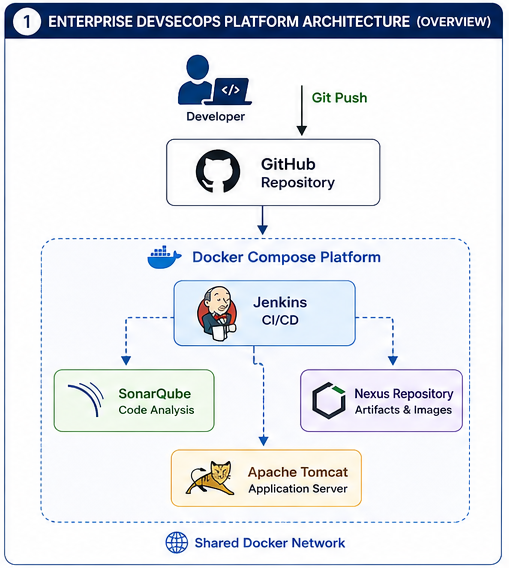

# Persistent Storage

## Overview

Persistent storage is a fundamental component of the Enterprise DevSecOps Infrastructure Platform. While Docker containers provide an isolated and portable runtime environment, they are inherently ephemeral. Any data stored inside a container's writable layer is lost when the container is removed or recreated.

To ensure platform reliability and operational continuity, the project uses Docker named volumes to separate application data from container lifecycles. This enables services to retain their configuration, databases, logs, repositories, and deployed applications across restarts, upgrades, and infrastructure changes.

Within this platform, persistent storage is used by:

- Jenkins
- SonarQube
- PostgreSQL
- Nexus Repository Manager
- Apache Tomcat

By externalizing application data from containers, the platform achieves repeatable deployments without sacrificing data durability.

---

# Why Persistent Storage Matters

Containers are designed to be disposable. While this characteristic improves deployment consistency, it introduces the risk of data loss if application data is stored inside the container filesystem.

Persistent storage addresses this challenge by ensuring that critical information remains available independently of container lifecycle events.

Key objectives include:

- Preserve application configuration
- Protect build history and metadata
- Maintain databases
- Store application artifacts
- Retain deployment files
- Enable disaster recovery
- Simplify upgrades
- Support infrastructure as Code

Without persistent storage, rebuilding a container would result in the loss of application state and operational history.

---

# Enterprise Storage Architecture

The Enterprise DevSecOps Infrastructure Platform separates compute resources from persistent data.



High-level storage architecture:

```
                 Enterprise DevSecOps Platform

                  Docker Compose Platform
                           │
        ┌──────────────────┼──────────────────┐
        │                  │                  │
        ▼                  ▼                  ▼
    Containers         Networks         Docker Volumes
                                               │
        ┌──────────────────────────────────────┼──────────────────────────────────────┐
        │              │              │              │              │                 │
        ▼              ▼              ▼              ▼              ▼                 ▼
  jenkins_home   sonarqube_data  sonar_postgres_data  nexus_data  tomcat_webapps  ...
```

Containers remain stateless while business-critical data is stored within dedicated Docker volumes.

---

# Storage Architecture Model

The platform follows a layered storage architecture.

```
Applications
      │
      ▼
Container Filesystem
      │
      ▼
Volume Mount
      │
      ▼
Docker Volume
      │
      ▼
Host Storage
```

Each layer has a distinct responsibility:

| Layer | Responsibility |
|--------|----------------|
| Application | Reads and writes data |
| Container Filesystem | Runtime execution environment |
| Volume Mount | Connects the application to persistent storage |
| Docker Volume | Stores application data |
| Host Storage | Provides physical disk capacity |

This abstraction allows containers to be replaced without affecting stored data.

---

# Ephemeral vs Persistent Storage

Understanding the difference between ephemeral and persistent storage is essential for containerized platforms.

## Ephemeral Storage

Ephemeral storage exists only for the lifetime of a container.

Characteristics:

- Temporary
- Automatically deleted with the container
- Suitable for caches and temporary files
- Not appropriate for production data

Example:

```
Container Removed

↓

Application Data Lost
```

---

## Persistent Storage

Persistent storage exists independently of containers.

Characteristics:

- Survives container recreation
- Maintains application state
- Supports backup and recovery
- Suitable for databases, repositories, and configuration

Example:

```
Container Removed

↓

Docker Volume Remains

↓

New Container Mounted

↓

Data Preserved
```

This persistence enables reliable upgrades and maintenance activities.

---

# Docker Volume Architecture

Docker named volumes are the primary persistence mechanism within the platform.

```
Docker Volume

        │

        ▼

Container Mount Point

        │

        ▼

Application
```

Docker manages the lifecycle of named volumes independently from containers, providing:

- Automatic creation
- Persistent storage
- Secure isolation
- Simplified management
- Consistent mounting

Named volumes are preferred over bind mounts because they provide greater portability and reduce host-specific dependencies.

---

# Platform Storage Inventory

The platform uses dedicated volumes for each service.

| Docker Volume | Service | Purpose |
|---------------|---------|---------|
| `jenkins_home` | Jenkins | Jobs, plugins, configuration, build history |
| `sonarqube_data` | SonarQube | Analysis indexes and application data |
| `sonarqube_logs` | SonarQube | Runtime and application logs |
| `sonarqube_extensions` | SonarQube | Installed plugins and extensions |
| `sonar_postgres_data` | PostgreSQL | SonarQube database |
| `nexus_data` | Nexus Repository Manager | Artifact repositories and blob stores |
| `tomcat_webapps` | Apache Tomcat | Deployed WAR files and web applications |

Each volume has a single, well-defined responsibility, reducing operational complexity.

---

# Storage Design Principles

The platform follows several enterprise storage principles.

## Separation of Compute and Data

Containers execute application workloads, while Docker volumes store persistent data.

---

## Data Durability

Critical information remains available regardless of container lifecycle events.

---

## Infrastructure as Code

Volume definitions are maintained within the Docker Compose configuration, ensuring consistent deployments.

---

## Service Isolation

Each service maintains its own dedicated storage area, reducing cross-service dependencies.

---

## Portability

Named volumes allow the platform to be deployed consistently across development and testing environments without modifying application configuration.

---

## Operational Simplicity

Docker automatically manages volume creation, mounting, and lifecycle, reducing manual administrative effort.

---

## Future Kubernetes Readiness

The current storage model closely aligns with Kubernetes Persistent Volumes (PV) and Persistent Volume Claims (PVC), simplifying future migration.

---

# Benefits of Persistent Storage

The storage architecture provides several operational advantages.

- Data survives container recreation
- Simplified platform upgrades
- Consistent deployments
- Reliable disaster recovery
- Easier backup management
- Improved operational stability
- Reduced configuration drift
- Better separation of responsibilities
- Cloud migration readiness

These characteristics ensure that platform state is preserved while infrastructure remains disposable.

---

# Summary

Persistent storage provides the data foundation for the Enterprise DevSecOps Infrastructure Platform.

By separating application data from container lifecycles through Docker named volumes, the platform ensures that Jenkins, SonarQube, PostgreSQL, Nexus Repository Manager, and Apache Tomcat retain their operational state across deployments, upgrades, and maintenance activities.

The next section examines the implementation of persistent storage for each platform component, including volume layout, mount strategy, runtime behavior, and service-specific storage requirements.

---

# Platform Storage Implementation

The Enterprise DevSecOps Infrastructure Platform uses Docker named volumes to persist application state across container restarts, upgrades, and recreation.

Each infrastructure component has dedicated storage designed specifically for its operational requirements.

This separation ensures:

- Independent lifecycle management
- Reduced risk of data corruption
- Simplified backup and recovery
- Better operational maintainability
- Clear ownership of application data

---

# Jenkins Storage

Jenkins stores nearly all operational information within the `jenkins_home` volume.

```
Jenkins Container
        │
        ▼
/var/jenkins_home
        │
        ▼
Docker Volume

jenkins_home
```

The volume contains:

- Jenkins configuration
- Installed plugins
- Build history
- Pipeline definitions
- Credentials
- User accounts
- Job configurations
- Workspace metadata

Without this volume, rebuilding the container would reset Jenkins to its initial installation state.

---

## Jenkins Storage Layout

Typical structure:

```
jenkins_home/

├── config.xml
├── credentials.xml
├── plugins/
├── jobs/
├── users/
├── workspace/
├── logs/
└── secrets/
```

This persistent layout allows Jenkins to recover seamlessly after container recreation.

---

# SonarQube Storage

SonarQube uses multiple dedicated volumes to separate operational data.

```
SonarQube Container
        │
        ├────────► sonarqube_data
        │
        ├────────► sonarqube_logs
        │
        └────────► sonarqube_extensions
```

This separation improves maintainability and simplifies backup strategies.

---

## sonarqube_data

Stores:

- Search indexes
- Analysis cache
- Internal application data

Characteristics:

- Frequently updated
- Critical for application performance
- Persistent across upgrades

---

## sonarqube_logs

Stores:

- Application logs
- Elasticsearch logs
- Web logs
- Runtime diagnostics

Benefits:

- Easier troubleshooting
- Log retention
- Operational monitoring

---

## sonarqube_extensions

Stores:

- Installed plugins
- Marketplace extensions
- Custom integrations

Separating extensions from application binaries simplifies upgrades while preserving installed functionality.

---

# PostgreSQL Storage

PostgreSQL maintains the SonarQube database.

```
PostgreSQL Container
          │
          ▼

/var/lib/postgresql/data

          │
          ▼

sonar_postgres_data
```

Stored information includes:

- Project metadata
- Analysis history
- Users
- Permissions
- Quality profiles
- Quality Gates
- Rule configurations

This is one of the most critical persistent volumes within the platform.

---

# Nexus Repository Storage

Nexus Repository Manager stores all artifacts inside the `nexus_data` volume.

```
Nexus Container
        │
        ▼

/nexus-data

        │
        ▼

Docker Volume

nexus_data
```

The volume contains:

- Maven artifacts
- Docker images
- Blob stores
- Repository metadata
- User configuration
- Security settings
- Scheduled tasks

Artifact persistence ensures that published software remains available even when the container is recreated.

---

## Nexus Storage Architecture

```
Nexus

     │

     ▼

Repository

     │

     ▼

Blob Store

     │

     ▼

nexus_data
```

This architecture separates repository metadata from binary artifact storage while maintaining both within persistent storage.

---

# Apache Tomcat Storage

Apache Tomcat stores deployed applications within the `tomcat_webapps` volume.

```
Tomcat Container
        │
        ▼

/usr/local/tomcat/webapps

        │
        ▼

Docker Volume

tomcat_webapps
```

Typical contents:

- WAR files
- Expanded web applications
- Static resources
- Deployment metadata

Persisting deployed applications simplifies maintenance and reduces deployment time after container recreation.

---

# Volume Mount Strategy

The platform follows a one-volume-per-service strategy.

```
Container

      │

      ▼

Dedicated Docker Volume

      │

      ▼

Persistent Application Data
```

Advantages:

- Service isolation
- Independent backups
- Easier troubleshooting
- Reduced operational risk

Each service owns and manages its own persistent storage.

---

# Runtime Storage Architecture

The runtime storage model separates execution from persistence.

```
Application

      │

      ▼

Container

      │

      ▼

Volume Mount

      │

      ▼

Docker Volume

      │

      ▼

Host Filesystem
```

During container startup:

1. Docker creates the container.
2. Volumes are mounted.
3. Applications access persistent data.
4. Services begin normal operation.

When containers stop, volumes remain intact.

---

# Docker Volume Lifecycle

The lifecycle of a Docker volume is independent of the container.

```
Create Volume
       │
       ▼
Attach to Container
       │
       ▼
Application Writes Data
       │
       ▼
Container Removed
       │
       ▼
Volume Retained
       │
       ▼
New Container Created
       │
       ▼
Volume Reattached
       │
       ▼
Application Continues
```

This lifecycle ensures that operational state survives infrastructure changes.

---

# Storage Communication Flow

The interaction between applications and persistent storage follows a consistent pattern.

```
Application
      │
      ▼
Container Filesystem
      │
      ▼
Mounted Volume
      │
      ▼
Docker Volume
      │
      ▼
Host Storage
```

Applications are unaware of the underlying storage implementation and simply read from or write to their configured filesystem paths.

---

# Storage Isolation

Each platform service uses dedicated storage to avoid interference with other components.

| Service | Dedicated Volume |
|----------|------------------|
| Jenkins | `jenkins_home` |
| SonarQube | `sonarqube_data`, `sonarqube_logs`, `sonarqube_extensions` |
| PostgreSQL | `sonar_postgres_data` |
| Nexus | `nexus_data` |
| Tomcat | `tomcat_webapps` |

This isolation improves reliability and simplifies maintenance operations.

---

# Storage Implementation Principles

The storage implementation follows several operational principles.

## Dedicated Storage

Every service owns its own persistent volume.

---

## Independent Lifecycle

Volumes remain available regardless of container lifecycle events.

---

## Separation of Responsibilities

Application execution and data persistence are managed independently.

---

## Simplified Maintenance

Storage can be backed up, restored, or migrated without rebuilding application containers.

---

## Future Portability

The volume strategy aligns closely with Kubernetes Persistent Volumes and Persistent Volume Claims, supporting future migration.

---

# Summary

The Enterprise DevSecOps Infrastructure Platform implements persistent storage through dedicated Docker named volumes assigned to each service.

This architecture ensures that Jenkins configuration, SonarQube analysis data, PostgreSQL databases, Nexus repositories, and Tomcat deployments remain available across container restarts, upgrades, and infrastructure changes.

The next section focuses on operational aspects of persistent storage, including verification, backup, restore procedures, troubleshooting, performance optimization, and security best practices.

---

# Storage Verification

After deploying the Enterprise DevSecOps Infrastructure Platform, verify that all persistent storage components are correctly provisioned and mounted before running CI/CD workloads.

A healthy storage environment ensures:

- Docker volumes exist
- Volumes are mounted correctly
- Applications can read and write data
- Persistent data survives container restarts
- Storage capacity is sufficient

---

# Verify Docker Volumes

List all Docker volumes.

```bash
docker volume ls
```

Expected output:

```
DRIVER    VOLUME NAME
local     jenkins_home
local     sonarqube_data
local     sonarqube_logs
local     sonarqube_extensions
local     sonar_postgres_data
local     nexus_data
local     tomcat_webapps
```

Confirm that every required volume has been created successfully.

---

# Inspect Volume Details

Display detailed information for a specific volume.

Example:

```bash
docker volume inspect jenkins_home
```

Verify:

- Driver
- Mountpoint
- Labels
- Creation timestamp

Repeat for each platform volume as required.

---

# Verify Volume Mounts

Inspect a running container.

Example:

```bash
docker inspect jenkins
```

Review the **Mounts** section.

Expected result:

```
Source:
Docker Volume

↓

Destination:
/var/jenkins_home
```

Perform similar verification for:

| Service | Mount Path |
|----------|------------|
| Jenkins | `/var/jenkins_home` |
| SonarQube | `/opt/sonarqube/data` |
| SonarQube | `/opt/sonarqube/logs` |
| SonarQube | `/opt/sonarqube/extensions` |
| PostgreSQL | `/var/lib/postgresql/data` |
| Nexus | `/nexus-data` |
| Tomcat | `/usr/local/tomcat/webapps` |

---

# Verify Data Persistence

Confirm that application data survives container recreation.

Example procedure:

1. Create a test job in Jenkins.
2. Restart or recreate the Jenkins container.

```bash
docker compose restart jenkins
```

3. Verify that:

- Jobs remain available
- Plugins remain installed
- Configuration is unchanged

Repeat similar validation for SonarQube, Nexus, PostgreSQL, and Tomcat.

---

# Storage Health Checks

Routine health checks should verify:

- Docker volumes exist
- Volume mounts are active
- Applications can access storage
- Disk utilization is acceptable
- No filesystem errors
- No unexpected permission issues

Recommended schedule:

| Environment | Frequency |
|--------------|-----------|
| Development | Daily |
| Production | Continuous monitoring |

---

# Backup Strategy

Persistent storage should be backed up regularly to protect platform state.

Recommended backup scope:

| Volume | Backup Required |
|---------|-----------------|
| jenkins_home | Yes |
| sonarqube_data | Yes |
| sonarqube_logs | Optional |
| sonarqube_extensions | Yes |
| sonar_postgres_data | Yes |
| nexus_data | Yes |
| tomcat_webapps | Yes |

A complete platform backup should also include:

- `docker-compose.yml`
- Environment files
- Jenkins pipeline definitions
- SSL certificates (if used)
- Custom configuration

---

# Backup Workflow

Recommended workflow:

```
Docker Volume
        │
        ▼
Backup Archive
        │
        ▼
Secure Storage
        │
        ▼
Backup Verification
```

Backups should be stored separately from the Docker host to improve resilience.

---

# Restore Strategy

Recovery should follow a structured process.

```
Stop Platform
      │
      ▼
Restore Volumes
      │
      ▼
Restore Configuration
      │
      ▼
Start Platform
      │
      ▼
Verify Applications
```

Example:

```bash
docker compose down
```

Restore persistent volumes.

Restart the platform.

```bash
docker compose up -d
```

Verify that:

- Jenkins jobs are present
- SonarQube history is intact
- PostgreSQL data is available
- Nexus repositories are accessible
- Tomcat applications are deployed

---

# Common Storage Issues

## Missing Volume

Symptoms:

- Application starts with default configuration
- Missing jobs
- Empty repositories

Possible causes:

- Volume deleted
- Incorrect Compose configuration
- Wrong volume name

Resolution:

- Verify `docker volume ls`
- Inspect Compose configuration
- Restore from backup if required

---

## Permission Errors

Symptoms:

```
Permission denied
```

Possible causes:

- Incorrect ownership
- Incorrect filesystem permissions
- Container user mismatch

Resolution:

- Inspect volume ownership
- Review container user configuration
- Correct permissions before restarting the service

---

## Insufficient Disk Space

Symptoms:

- Database write failures
- Nexus upload failures
- Jenkins build failures

Verify disk usage.

```bash
df -h
```

Free unused resources or expand available storage.

---

## Volume Not Mounted

Symptoms:

- Empty application directories
- Missing configuration
- Startup failures

Resolution:

```bash
docker inspect <container>
```

Confirm that the expected volume is mounted to the correct destination path.

---

# Storage Troubleshooting

Recommended troubleshooting workflow:

```
Application Issue
        │
        ▼
Verify Container
        │
        ▼
Verify Volume Exists
        │
        ▼
Inspect Mount
        │
        ▼
Check Permissions
        │
        ▼
Review Logs
        │
        ▼
Restore if Required
```

Following a consistent workflow reduces diagnosis time and minimizes unnecessary changes.

---

# Performance Optimization

Storage performance directly affects platform responsiveness.

Recommended practices:

## Use SSD Storage

Store Docker volumes on SSDs whenever possible to improve:

- Jenkins build performance
- PostgreSQL responsiveness
- Nexus artifact retrieval
- SonarQube indexing

---

## Monitor Disk Utilization

Check storage usage regularly.

```bash
df -h
```

Monitor Docker disk consumption.

```bash
docker system df
```

---

## Archive Historical Data

Periodically archive:

- Old Jenkins build history
- Outdated SonarQube analyses
- Obsolete Nexus artifacts
- Unused application deployments

This helps control storage growth.

---

## Clean Unused Resources

Remove unused Docker resources when appropriate.

```bash
docker system prune
```

**Important:** Review the impact carefully before executing this command, as it may remove resources that are no longer referenced.

---

# Storage Security Best Practices

Persistent data often contains sensitive operational information.

Recommended practices:

- Protect Docker host access.
- Restrict filesystem permissions.
- Back up data securely.
- Encrypt backups when appropriate.
- Scan stored artifacts for vulnerabilities.
- Rotate credentials regularly.
- Monitor storage usage.
- Protect Jenkins credentials.
- Secure Nexus repositories.
- Limit access to PostgreSQL data.

---

# Operational Best Practices

Storage operations should follow consistent procedures.

Recommended practices:

- Verify storage after every deployment.
- Test backups regularly.
- Validate restore procedures.
- Monitor available capacity.
- Review filesystem health.
- Keep Docker volumes dedicated to a single service.
- Avoid storing critical data inside container filesystems.
- Document storage changes.
- Review backup schedules periodically.

---

# Summary

Persistent storage is essential for maintaining the operational state of the Enterprise DevSecOps Infrastructure Platform.

Through regular verification, structured backup and restore procedures, proactive troubleshooting, performance optimization, and secure operational practices, Docker volumes provide reliable persistence for Jenkins, SonarQube, PostgreSQL, Nexus Repository Manager, and Apache Tomcat.

The final section explores enterprise storage architecture, cloud storage integration, Kubernetes persistent storage, migration strategies, and long-term evolution toward production-grade storage platforms.

---

# Production Storage Architecture

The current storage implementation is optimized for development, testing, and learning environments. In production, storage requirements extend beyond persistence to include high availability, scalability, data protection, and disaster recovery.

A production-grade storage architecture typically incorporates:

- Shared enterprise storage
- High-performance storage arrays
- Redundant storage paths
- Automated backups
- Data replication
- Storage monitoring
- Encryption at rest
- Disaster recovery planning

These capabilities ensure that application data remains available even during hardware failures or maintenance operations.

---

# Enterprise Storage Architecture

A typical enterprise deployment separates compute resources from dedicated storage infrastructure.

```
                   Enterprise Storage Architecture

                    Docker / Kubernetes Cluster
                              │
        ┌─────────────────────┼─────────────────────┐
        │                     │                     │
        ▼                     ▼                     ▼
    Jenkins              SonarQube             Nexus
        │                     │                     │
        └──────────────┬──────┴──────────────┬──────┘
                       ▼                     ▼
                Enterprise Storage Platform
                       │
        ┌──────────────┼──────────────┐
        │              │              │
        ▼              ▼              ▼
      SSD SAN        NAS        Object Storage
```

Benefits include:

- Centralized storage management
- Higher performance
- Improved reliability
- Easier backup operations
- Better scalability
- Simplified disaster recovery

---

# External Storage

Enterprise platforms often replace local Docker volumes with external storage systems.

Common options include:

| Storage Type | Typical Usage |
|--------------|---------------|
| NAS | Shared application data |
| SAN | Databases and high-performance workloads |
| NFS | Shared container storage |
| SMB/CIFS | Windows-based environments |
| Object Storage | Backups and archives |

External storage enables multiple hosts to access shared data while supporting redundancy and centralized administration.

---

# Cloud Storage Integration

As organizations adopt cloud-native infrastructure, persistent storage is commonly provided by managed cloud services.

Examples include:

| Cloud Provider | Storage Service |
|----------------|-----------------|
| AWS | Amazon EBS, Amazon EFS, Amazon S3 |
| Microsoft Azure | Azure Managed Disks, Azure Files |
| Google Cloud | Persistent Disk, Filestore, Cloud Storage |
| Red Hat OpenShift | OpenShift Data Foundation |

Cloud-managed storage provides:

- Automatic redundancy
- Snapshot capabilities
- Elastic scalability
- Managed lifecycle
- High availability
- Reduced operational overhead

---

# High Availability Storage

Production environments should eliminate single points of failure within the storage layer.

Recommended capabilities include:

- Storage replication
- RAID protection
- Automatic failover
- Multiple storage controllers
- Multi-zone redundancy
- Regular integrity checks

These features improve service continuity during hardware failures or maintenance activities.

---

# Disaster Recovery Strategy

Persistent storage forms the foundation of disaster recovery planning.

A typical recovery process includes:

```
Production Storage
        │
        ▼
Scheduled Backup
        │
        ▼
Off-site Storage
        │
        ▼
Disaster Event
        │
        ▼
Restore Platform
        │
        ▼
Validate Services
```

Recovery planning should define:

- Recovery Point Objective (RPO)
- Recovery Time Objective (RTO)
- Backup frequency
- Restore validation procedures

Regular disaster recovery testing helps ensure that backup processes remain reliable.

---

# Kubernetes Persistent Storage

Docker named volumes provide an excellent foundation for understanding Kubernetes persistent storage concepts.

| Docker Compose | Kubernetes |
|----------------|------------|
| Docker Volume | Persistent Volume (PV) |
| Volume Mount | Volume Mount |
| Named Volume | Persistent Volume Claim (PVC) |
| Host Storage | Storage Class |
| Container | Pod |

Because applications already use mounted storage paths, migration requires minimal application changes.

---

# Kubernetes Storage Architecture

A future Kubernetes deployment may follow the architecture below.

```
Application Pod
       │
       ▼
Volume Mount
       │
       ▼
Persistent Volume Claim
       │
       ▼
Persistent Volume
       │
       ▼
Storage Class
       │
       ▼
Cloud / Enterprise Storage
```

This abstraction allows storage resources to be dynamically provisioned while preserving application portability.

---

# Storage Migration Strategy

The current Docker Compose storage model provides a straightforward migration path to Kubernetes.

Recommended migration steps:

1. Identify all persistent Docker volumes.
2. Create corresponding Persistent Volumes (PV).
3. Define Persistent Volume Claims (PVC).
4. Configure appropriate Storage Classes.
5. Deploy applications with persistent volume mounts.
6. Migrate application data.
7. Validate application functionality.
8. Decommission legacy storage.

Because the platform already separates compute from data, the migration process is significantly simplified.

---

# Storage Lifecycle Management

Enterprise storage should be managed throughout its lifecycle.

Typical stages include:

```
Provision
     │
     ▼
Monitor
     │
     ▼
Backup
     │
     ▼
Archive
     │
     ▼
Restore (if required)
     │
     ▼
Retire
```

Lifecycle management helps optimize storage utilization while maintaining compliance and operational reliability.

---

# Future Storage Enhancements

The current architecture can evolve to support additional enterprise capabilities.

Potential enhancements include:

- Storage encryption
- Automated snapshot scheduling
- Immutable backups
- Cross-region replication
- Policy-based retention
- Tiered storage
- Automated cleanup
- Capacity forecasting
- Self-service storage provisioning

These improvements increase resilience and reduce manual operational effort.

---

# Related Documentation

Persistent storage should be understood alongside the following documents.

| Document | Purpose |
|----------|---------|
| 05_Jenkins.md | Jenkins data and configuration |
| 06_SonarQube.md | Analysis data persistence |
| 07_Nexus.md | Artifact storage architecture |
| 08_Tomcat.md | Application deployment storage |
| 09_Docker_Compose.md | Infrastructure orchestration |
| 10_Network_Architecture.md | Service communication |
| 12_Troubleshooting.md | Operational issue resolution |

Together, these guides provide a complete understanding of platform infrastructure and operations.

---

# Enterprise Summary

Persistent storage provides the operational foundation for the Enterprise DevSecOps Infrastructure Platform.

By separating application data from container lifecycles, the platform enables reliable deployments, preserves operational state, and simplifies maintenance activities.

The storage architecture emphasizes:

- Data durability
- Service isolation
- Backup and recovery
- Operational simplicity
- Infrastructure as Code
- Cloud readiness
- Kubernetes compatibility

These principles ensure that Jenkins, SonarQube, PostgreSQL, Nexus Repository Manager, and Apache Tomcat retain critical data throughout the software delivery lifecycle.

---

# Conclusion

Persistent storage is a critical pillar of the Enterprise DevSecOps Infrastructure Platform.

The use of Docker named volumes provides reliable, service-specific persistence while maintaining the flexibility and portability of containerized applications. Through structured storage design, regular verification, comprehensive backup and recovery procedures, and adherence to enterprise operational practices, the platform safeguards application state across deployments, upgrades, and infrastructure changes.

Furthermore, the current implementation establishes a clear path toward enterprise storage platforms and Kubernetes-native persistent storage, enabling future adoption of highly available, cloud-managed infrastructure without requiring significant application redesign.
